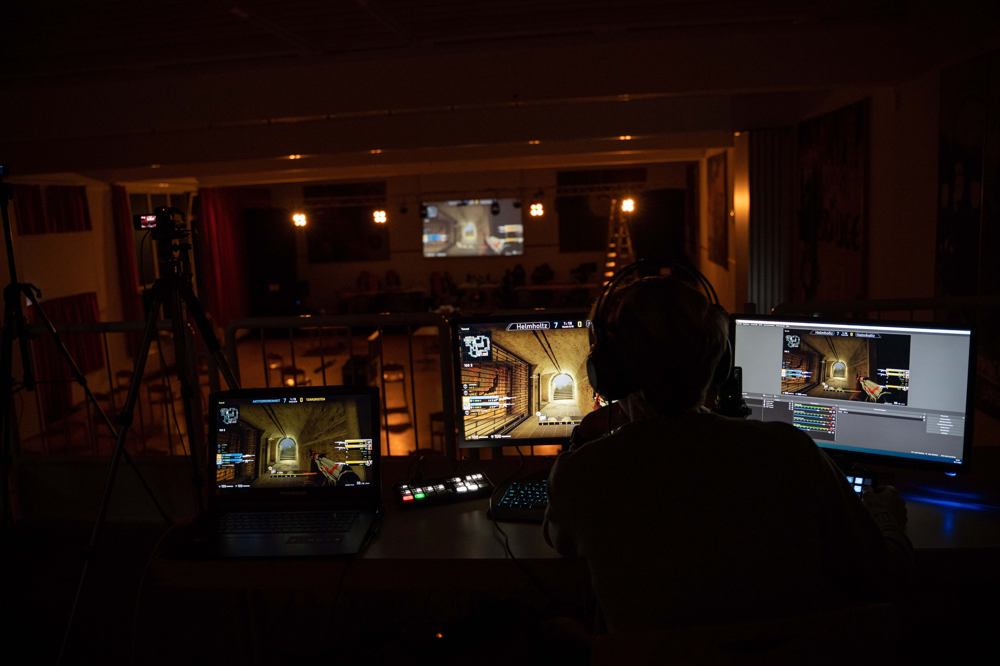

# Die Heidelberger E-Sport Tage 2021
Das erste Event der Heidelberger E-Sport Tage!

## Übersicht
* **Datum:** 03./04.05. November 2021
* **Location:** [Stadtjugendring Heidelberg](../uebersicht/orte/heidelberg-stadtjugendring.md)
* **Spiele:** [FIFA 2022](), [League of Legends](), [Counter-Strike: Globale Offensive]()
* **Teilnehmeranzahl**: ca. 80 in Präsenz / Max. 250 gleichzeitge Life-Stream-Zuschauer

## Partner
Die Heidelberger E-Sport Tage wurden in Kooperation mit dem Jugendgemeinderat Heidelberg (Projektleitung), E-Sport Rhein-Neckar (Technik) und dem Stadtjugendring Heidelberg (Veranstaltungsort) durchgeführt.

## Personen
Diese Personen haben die Heidelberger E-Sport Tage mitgestalltet:

* **[Paul Goldschmidt](../uebersicht/menschen/paulgoldschmidt):** Eventorganisation
* **[Emil Staab](../uebersicht/menschen/emilstaab):** Eventtechnik

## Hintergrundinformationen
Als erste E-Sport-Veranstaltung in Heidelberg wurden die E-Sport-Tage 2021 unter dem Motto "Drei Tage, Drei Spiele, 18 Schulen aus Heidelberg" durchgeführt. Dabei ist uns 

## Learnings
### Was gut Funktioniert hat
* Mobilfunknummern einsammeln - Whatsapp Business
* Flagge bestellen
 
### Was Verbesserungspotenzial besaß:
* Papier-Anmeldung (nächstes Mal mit Ticketsystem)
* Zeitrahmen (in der Schulzeit), und direkt nach den Sommerferien ungünstig -> SMVs neu gewählt, noch keine Feste Struktur an den Schulen
* Zu lange Aufwärmspiel bei FIFA
* Internet-Verbindung (nächstes Mal ausschließlich lokale Server)
* Lokale Stream-Aufzeichung (VOD) bei Twitch an!

## Aftermovie

## Bilder
Alle Bilder von Paul Goldschmidt:

