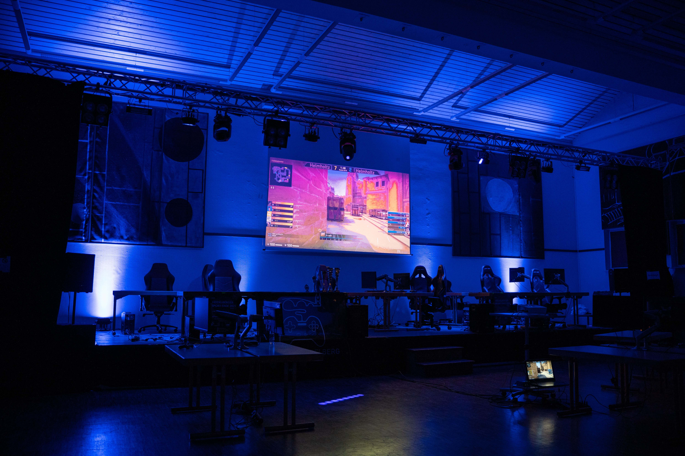
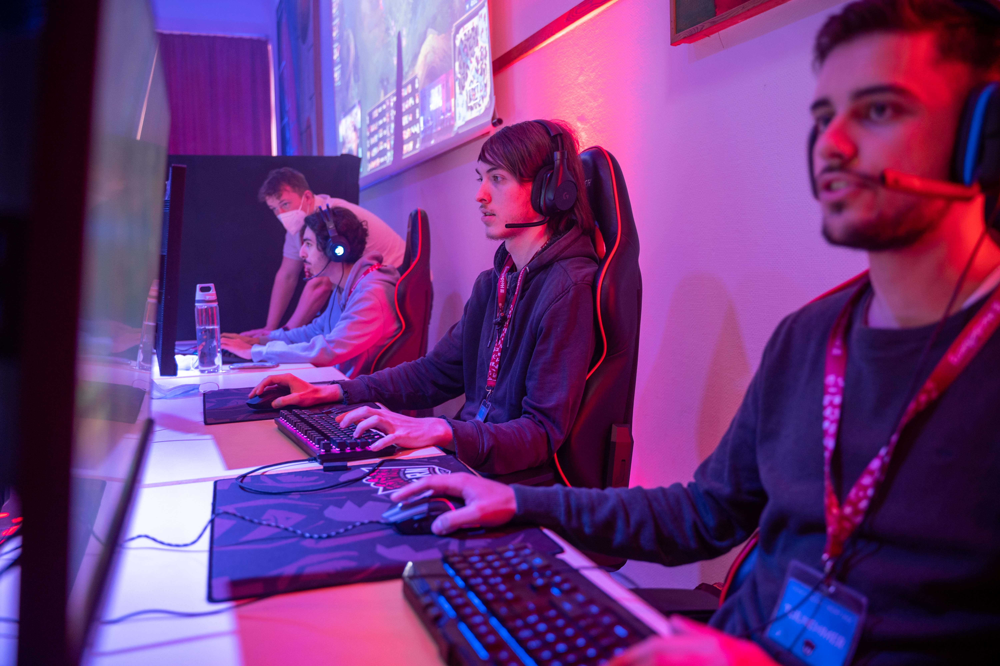
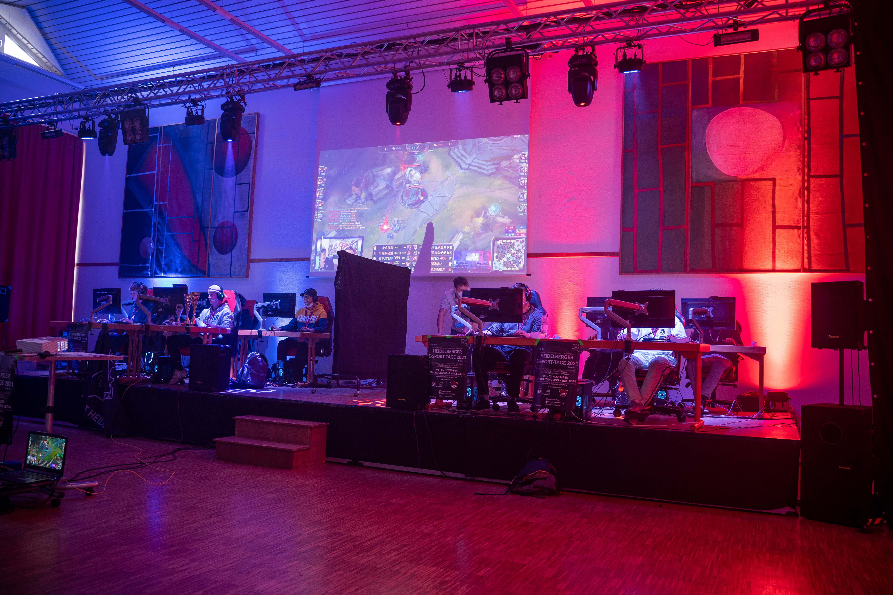
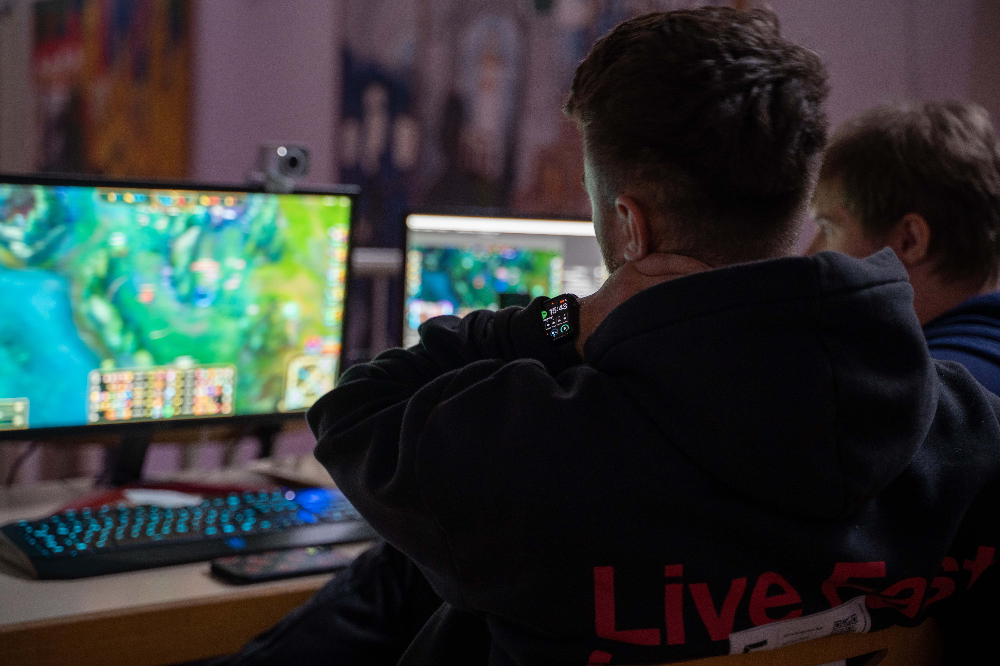
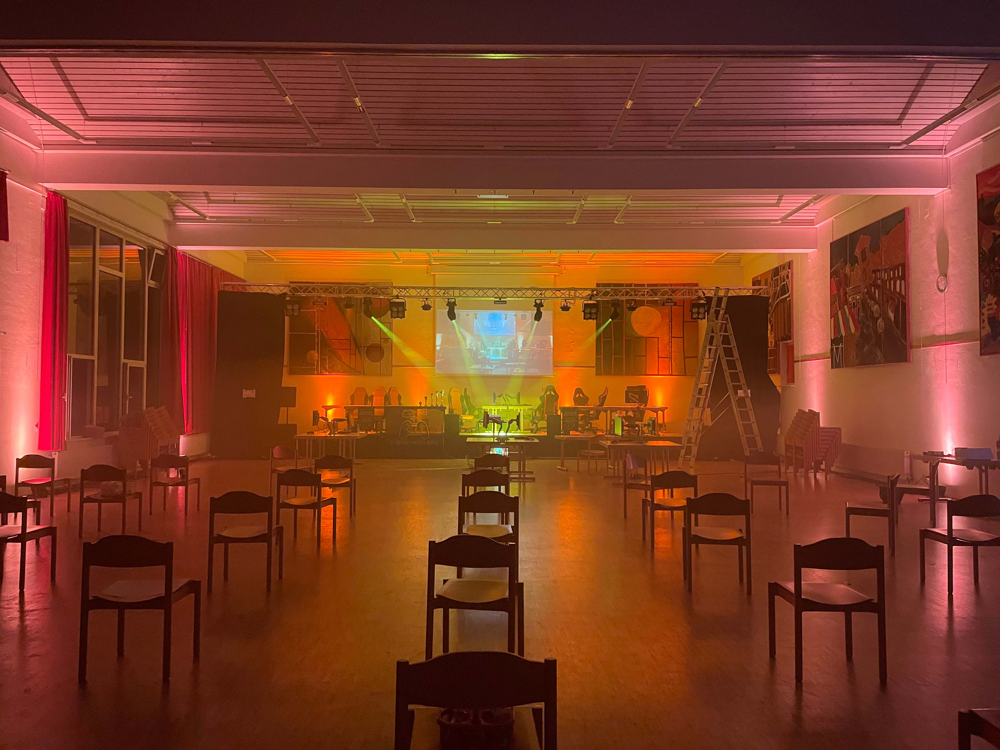
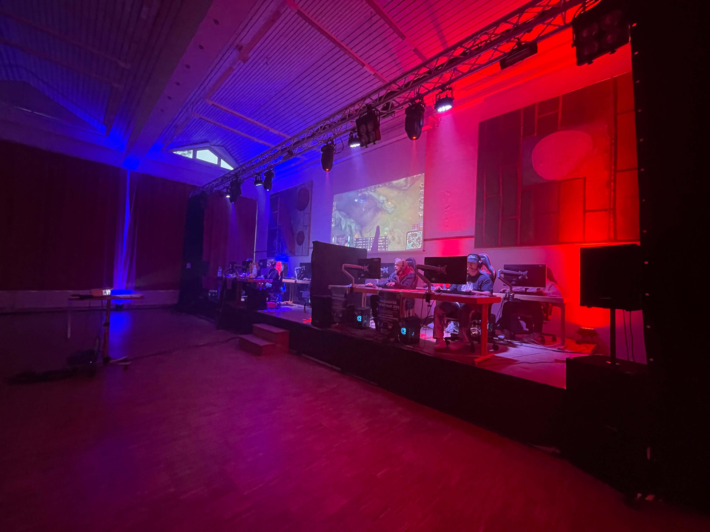
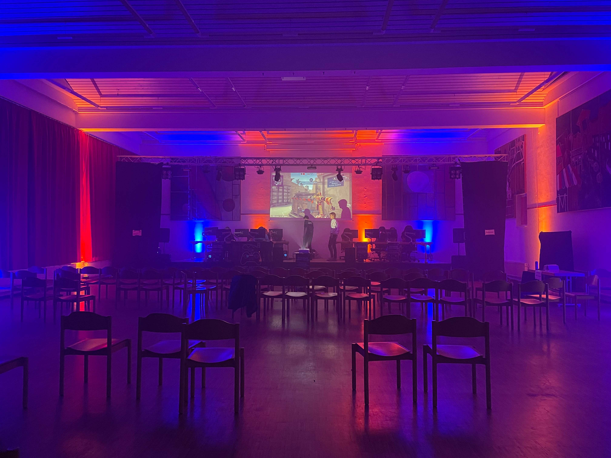
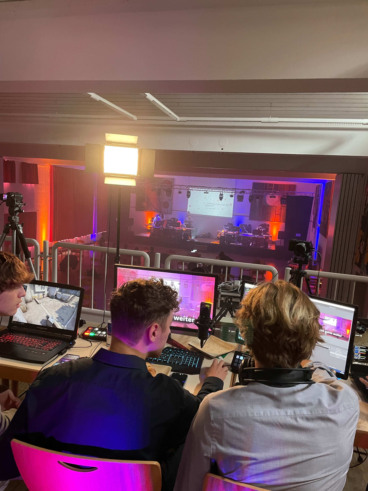
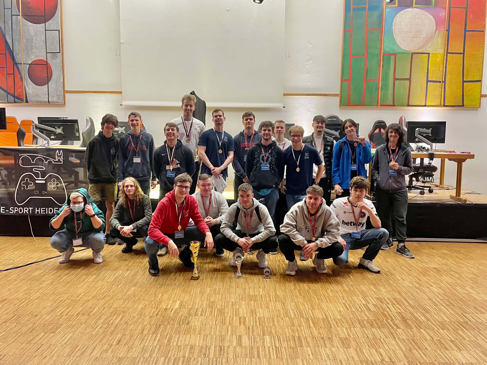
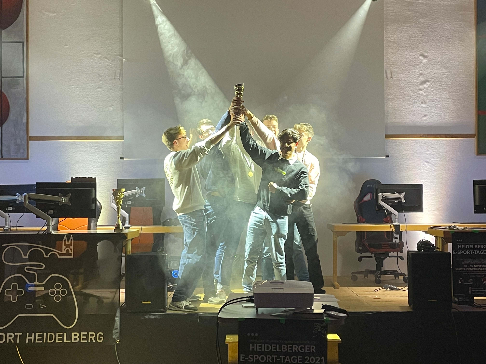

# Die Heidelberger E-Sport Tage 2021
Das erste Event der Heidelberger E-Sport Tage!

## Übersicht
* **Datum:** 03./04./05. November 2021
* **Location:** [Stadtjugendring Heidelberg](../uebersicht/orte/heidelberg-stadtjugendring.md)
* **Partner:** [Jugendgemeinderat Heidelberg](../uebersicht/partner/heidelberg-jugendgemeinderat.md), [Stadtjugendring Heidelberg](../uebersicht/partner/heidelberg-stadtjugendring.md), [E-Sport Rhein-Neckar](../uebersicht/partner/mannheim-esportrheinneckar.md)
* **Spiele:** [FIFA 2022](../uebersicht/spiele/fifa.md), [League of Legends](../uebersicht/spiele/league-of-legends.md), [Counter-Strike: Globale Offensive](../uebersicht/spiele/csgo.md)
* **Teilnehmeranzahl**: ca. 80 in Präsenz / Max. 250 gleichzeitge Live-Stream-Zuschauer

## Personen
Diese Personen haben die Heidelberger E-Sport Tage mitgestaltet:

* **[Emil Staab](../uebersicht/personen/emilstaab):** Eventtechnik
* **[Angelika Magin](../uebersicht/personen/angelikamagin):** Veranstaltungs-Management
* **[Steffen Wörner](../uebersicht/personen/steffenwoerner):** Veranstaltungsstätten-Management
* **[Jonas Stratmann](../uebersicht/personen/jonasstratmann):** Technische Leitung
* **[Paul Goldschmidt](../uebersicht/personen/paulgoldschmidt):** Eventorganisation

## Hintergrundinformationen
Als erste E-Sport-Veranstaltung in Heidelberg wurden die E-Sport-Tage 2021 unter dem Motto "Drei Tage, Drei Spiele, 18 Schulen aus Heidelberg" durchgeführt.

## Learnings
### Was gut Funktioniert hat
* Mobilfunknummern einsammeln - und ggf. per Whatsapp Business anschreiben
* Die Flagge kam gut an!
 
### Was Verbesserungspotenzial besaß:
* Papier-Anmeldung war zu Umständlich
* Zeitrahmen (in der Schulzeit), und direkt nach den Sommerferien ungünstig -> SMVs neu gewählt, noch keine Feste Struktur an den Schulen
* Zu lange Aufwärmspiel bei FIFA gewählt
* Internet-Verbindung (nächstes Mal ausschließlich lokale Server)
* Lokale Stream-Aufzeichung (VOD) **auf externer SSD** bei Twitch in hoher Qualität an!
* Abbau war aufgrund der geringen Helferanzahl sehr anstrengend

## Aftermovie

## Bilder
Alle Bilder von Paul Goldschmidt:

