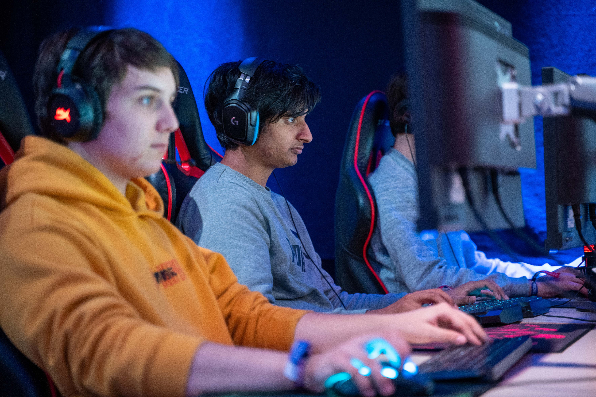
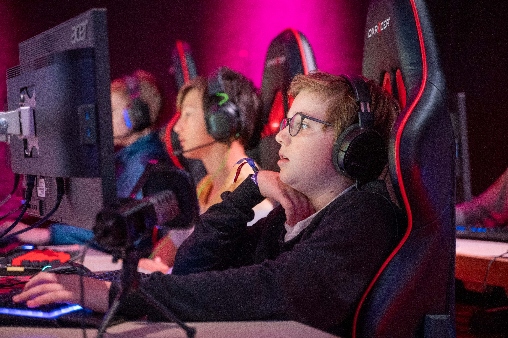
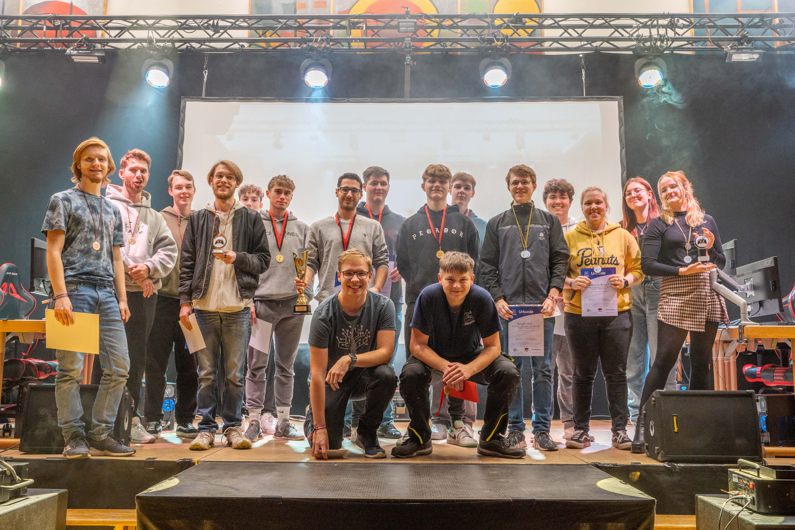
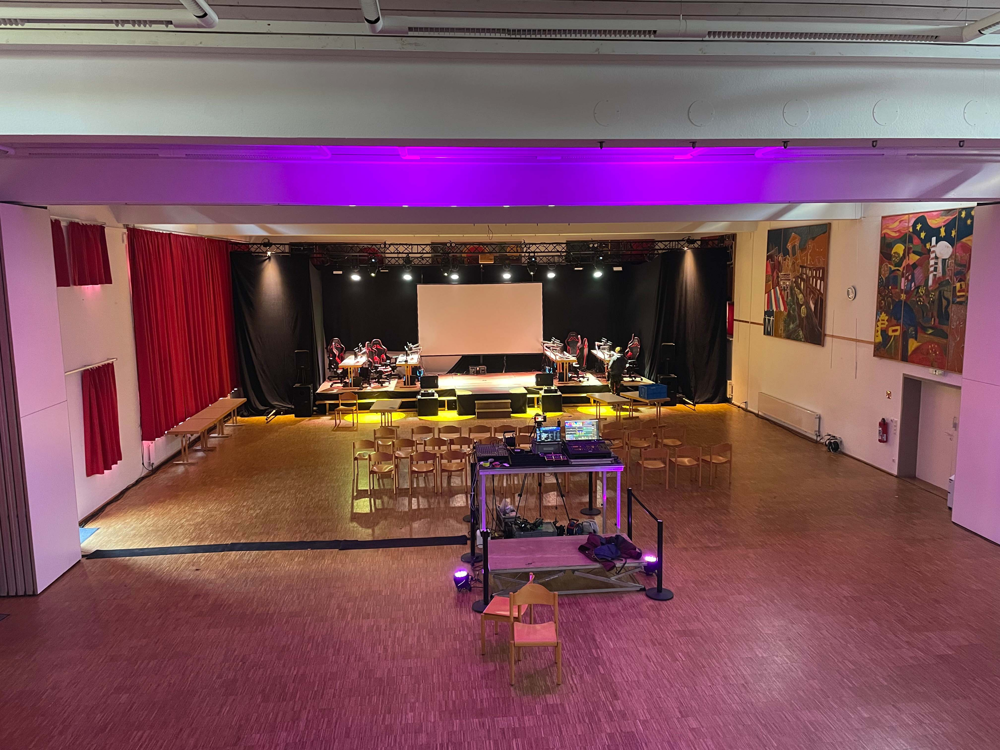
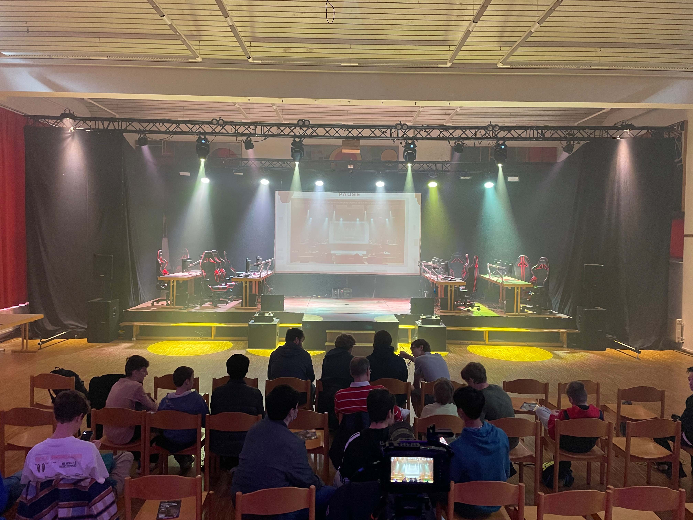
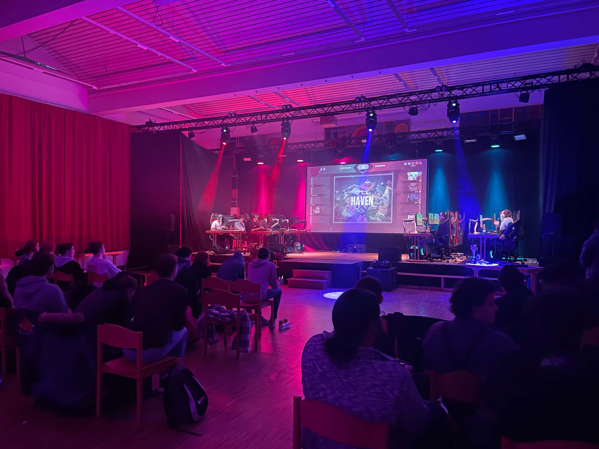
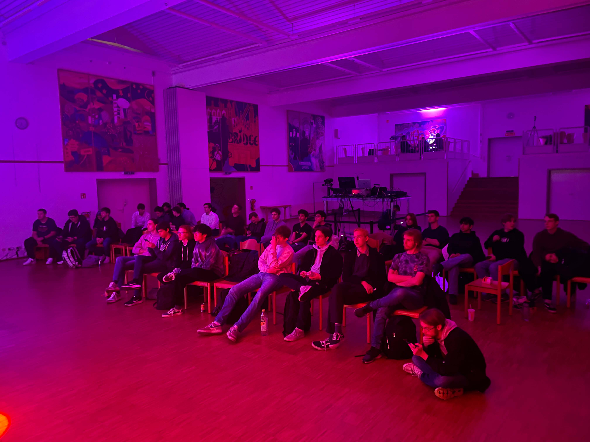
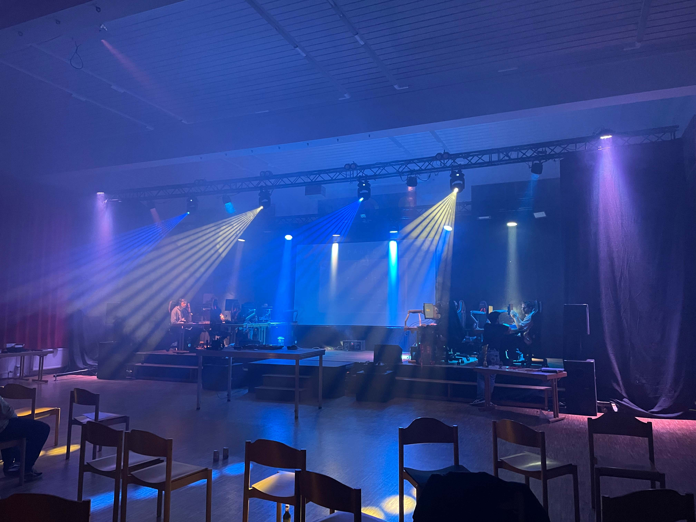

# Die Heidelberger E-Sport Tage 2022
Der Erfolg geht in die zweite Runde!

## Übersicht
* **Datum:** 01./02./03./04. November 2022
* **Location:** [Stadtjugendring Heidelberg](../uebersicht/orte/heidelberg-stadtjugendring.md)
* **Partner:** [Jugendgemeinderat Heidelberg](../uebersicht/partner/heidelberg-jugendgemeinderat.md), [Stadtjugendring Heidelberg](../uebersicht/partner/heidelberg-stadtjugendring.md), [E-Sport Rhein-Neckar](../uebersicht/partner/mannheim-esportrheinneckar.md)
* **Spiele:** [FIFA 2022](../uebersicht/spiele/fifa.md), [Rocket League](../uebersicht/spiele/rocketleague.md), [Valorant](../uebersicht/spiele/valorant.md), [Counter-Strike: Globale Offensive](../uebersicht/spiele/csgo.md)
* **Teilnehmeranzahl**: ca. 120 in Präsenz / Max. 600 gleichzeitge Live-Stream-Zuschauer

## Personen
Diese Personen haben die Heidelberger E-Sport Tage mitgestaltet:

* **[Emil Staab](../uebersicht/personen/emilstaab):** Eventtechnik
* **[Angelika Magin](../uebersicht/personen/angelikamagin):** Veranstaltungs-Management
* **[Steffen Wörner](../uebersicht/personen/steffenwoerner):** Veranstaltungsstätten-Management
* **[Katharina Spinner](../uebersicht/personen/katharinaspinner):** Technische Leitung
* **[Paul Goldschmidt](../uebersicht/personen/paulgoldschmidt):** Eventorganisation

## Hintergrundinformationen
Nach dem Erfolg des Jahres 2021 wurde das Projekt unter nahezu gleichen Umständen wieder durchgeführt. 

## Learnings
### Was gut Funktioniert hat
* Eigener Streamingraum: Top Sache das
 
### Was Verbesserungspotenzial besaß:
* 

## Aftermovie

## Bilder
Alle Bilder von Paul Goldschmidt:

