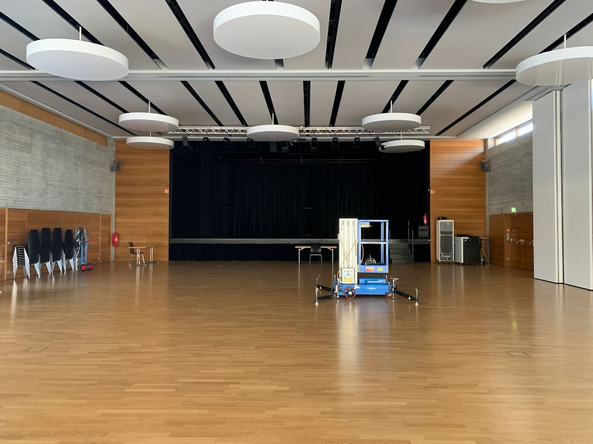

# Bürgerhaus Heidelberg

In Heidelberg-Emmertsgrund gelegen war das Bürgerhaus Heidelberg die erste Location, die wir uns angeschaut haben. Am Ende dann wegen schlechter Anbindung und nicht optimaler Verfügbarkeit gegen die Halle des Stadtjugendrings im Haus am Harbigweg als Option fallen gelassen. 
## Wissenswertes zu der Location
* **Kosten:** (Stand 2021) 165 Euro pro Tag
* **Ansprechpartner:** [Verwaltung des Bürgerhauses Heidelberg](mailto:verwaltung-buergerhaus@emmertsgrund.de)
* **Kapazität:** Ausreichend, vergleichbar mit der [Halle des Haus am Harbigweg](heidelberg-stadtjugendring.md)
* **Interessantes:** Leider recht schlecht angebunden, Internetsituation ungeklärt. HD4You-WLAN verfügbar, Stabilität fraglich