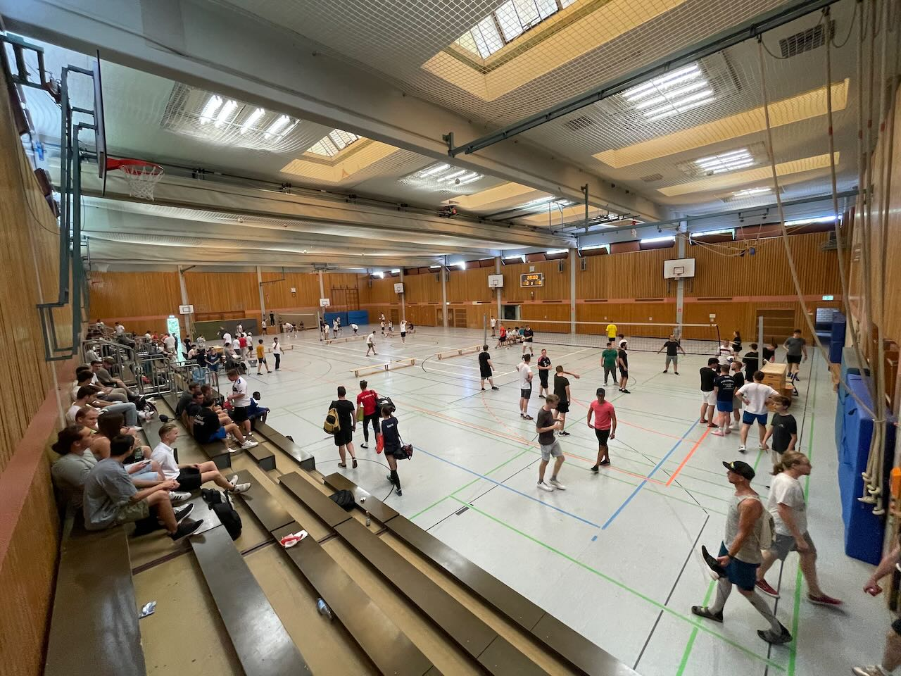

# Neckarhalle Heidelberg

In Heidelberg-Wieblingen gelegen, war die Neckarhalle die erste Überlegung als Austragungsort für die Heidelberger E-Sport Tage.
## Wissenswertes zu der Location
* **Info:** Um in der Halle eine Veranstaltung wie die Heidelberger E-Sport Tage durchzuführen, müsste man erst den kompletten Boden mit einem Teppich auslegen, Kosten unbekannt.
* **Vermietung:** Durch die Stadt Heidelberg. Kosten Unbekannt, selten Verfügbar.
## Zusammenfassung
Kaum für die Heidelberger E-Sport Tage spannend.