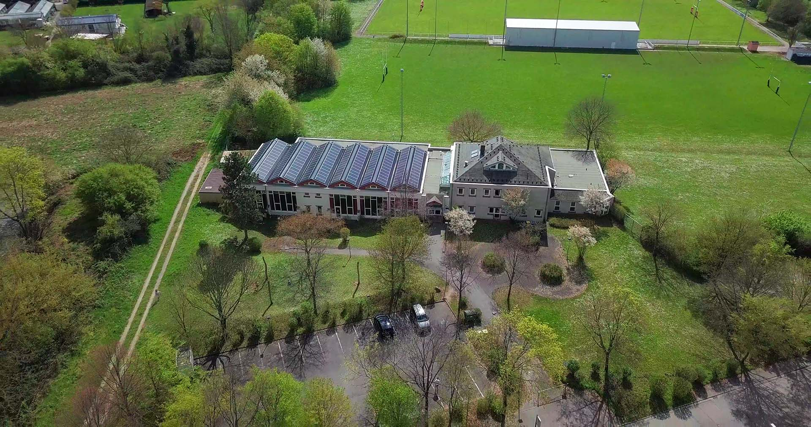
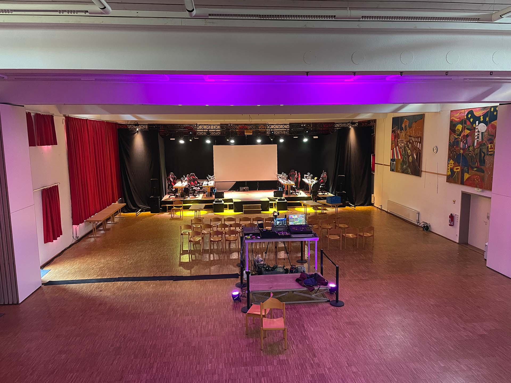

# Die Halle des Stadtjugendrings im Haus am Harbigweg

Die Halle des Stadtjugendrings: Hier hat alles mit den E-Sport Tagen begonnen!
## Wissenswertes zu der Location
* **Platz:** Genug. Mindestens 250 Personen passen gleichzeitig in den großen Saal. Zudem viele Nebenräume, die z.B. für Streaming verwendet werden können.
* **Kosten:** Abzusprechen mit dem [Stadtjugendring Heidelberg](..//partner/heidelberg-stadtjugendring.md) bzw. [Steffen Wörner](../personen/steffenwoerner.md). Man wird sich bestimmt einig in der Hinsicht.
* **Ort:** In Heidelberg Kirchheim gelegen, ist die Halle gut mit den Öffis erreichbar.
* **Infrastruktur:** Vieles (inkl. Küche) ist vorhanden. Nur der Hallendecke sollte man keine Eventtechnik zutrauen, sprich mit Traversen arbeiten.
* **Zu beachten:** Internetsituation ist aktuell sehr schlecht - nur lokale Server sind wirklich sinnvoll bei den Events.
## Bilder

.](../../img/uebersicht/orte/stadtjugendring3.jpg)