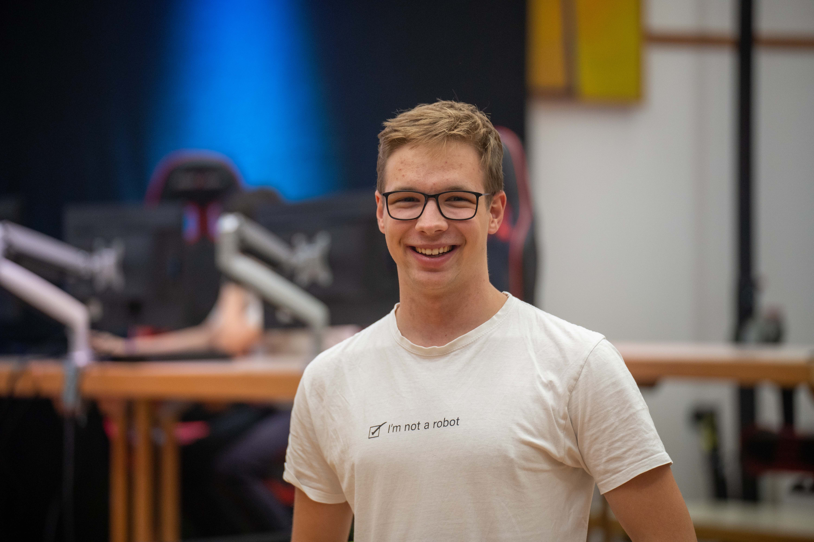
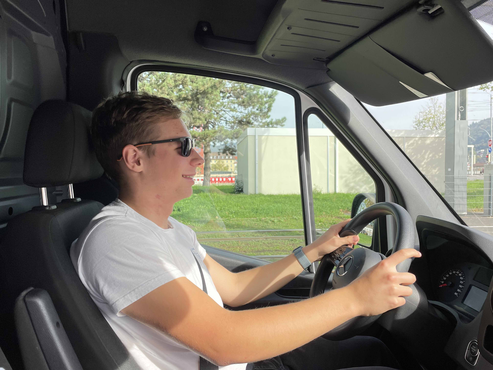

# Paul Goldschmidt

Moin! Ich bin Paul. Im September 2020 wurde ich bei einer gemütlichen Runde Counter-Strike: Globale Offensive von zwei unterschiedlichen Freundesgruppen gefragt, ob ich nicht mit ihnen zusammen spielen möchte. Kurzerhand versuchte ich, ein kleines Turnier zwischen den beiden Gruppen (welche von zwei unterschiedlichen Schulen kamen) zu organisieren - dies klappte eher semi-gut, trotzdem war die Idee geboren: Warum nicht ein Schulturnier für E-Sport-Titel in Heidelberg organisieren, an dem Schüler:innen teilnehmen können. Dass ich zu dieser Zeit im [Heidelberger Jugendgemeinderat](https://www.heidelberg.de/hd/HD/Rathaus/Jugendgemeinderat.html) saß, eröffnte mir auch eine direkte Perspektive, wie ein solches Event umsetzbar seien könnte. [Eine Präsentation](../../img/sonstiges/dieanfaenge.pdf) am 07.10.2020 im Jugendgemeinderat (noch unter dem Titel "HD-Open") später und das Projekt wart geboren. 13 Monate später fand dann mit den [E-Sport Tagen 2021](../../events/esporttage2021.md) eine erste Verwirklichung dieser Idee statt.

## Meine Rolle bei den E-Sport-Tagen
Meistens renne ich zwischen allen Stellen hin und her und versuche, dass nichts anbrennt - als Organisator der [E-Sport Tage 2021](../../events/esporttage2021.md) und der [E-Sport Tage 2022](../../events/esporttage2022.md) habe ich sonst alle möglichen Jobs übernommen, also von Marketing bis zu Playermanagement und dem Schnitt des Aftermovies.

## Wie man mich erreicht
Am besten, man schreibt mir eine [Mail](mailto:kontakt@paul-goldschmidt.de) oder eine [Telegram](https://t.me/paulgoldschmidt)-Nachricht. Sonst bin ich auch gut auf [Instagram](https://instagram.com/_paulgoldschmidt) erreichbar.
